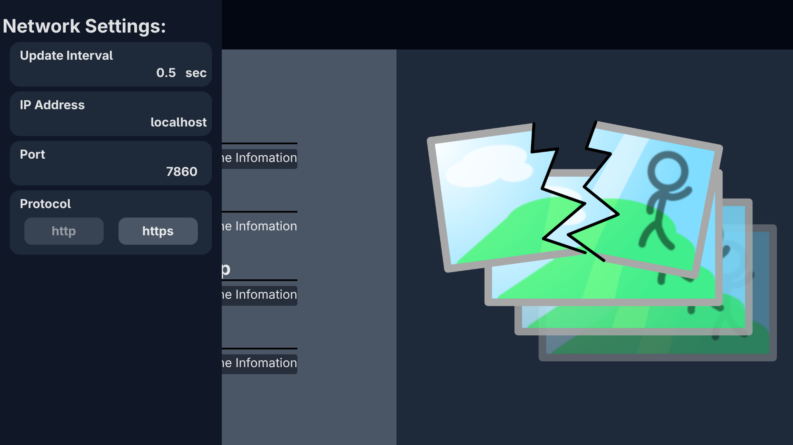

# Stable diffusion webui infomation panel
 While i use Stable diffusion WebUI from [AUR (en) - stable-diffusion-webui](https://www.nyanmo.info/posts/linux/stablediffusionwebui/). That works but i find that i can't see the progress when i accidentally close the WebUI. Later, i find an entry point "/sdapi/v1/progress" that return JSON response about the progress. So i decided to create my own progress viewer rely on the API possibly disappear in the future.


# How to use
## 1. Allow CORS
### WebUI itself (if needed)
/etc/stable-diffusion-webui/webui.conf
```
ACCELERATE_FLAGS="--num_cpu_threads_per_process=6"

WEBUI_FLAGS="--listen --api --api-log --xformers --disable-safe-unpickle --enable-insecure-extension-access --cors-allow-origins 'http://yourFrontendIP:yourFrontendPort'"

DATA_DIR="/your/path/to/the/data/for/stable/diffusion"
```
If you have no error on the WebUI log about GET requests this frontend made, the WebUI probably has already been working and returned API responses but got blocked somewhere else. In my case, httpd block the API responses without CORS configuration.

### Allow CORS on HTTPD Virtual Host
This is an example of `/etc/httpd/conf/extra/httpd-vhosts.conf`.
```conf
<VirtualHost *:443>
	ServerName your.server.name

	SSLEngine on
	SSLCertificateFile "/savePlace/ssl/your.server.name.pem"
  SSLCertificateKeyFile "/savePlace/ssl/your.server.name-key.pem"

  # CORS settings ---------------------------------------
  # CORS settings ---------------------------------------
	Header set Access-Control-Allow-Origin "*" # To be secure, specifiy your frontend URL. "http://yourFrontendIP:yourFrontendPort"
	Header set Access-Control-Allow-Methods "GET, POST, OPTIONS"
	Header set Access-Control-Allow-Headers "Content-Type, Accept, Origin"
  # CORS settings ---------------------------------------
  # CORS settings ---------------------------------------

  RewriteEngine On
  RewriteCond %{HTTP:Upgrade} =websocket [NC]
  RewriteCond %{HTTP:Connection} upgrade [NC]
  RewriteRule ^/(.*) "ws://localhost:7860/$1" [P,L]

	ProxyPreserveHost on
	ProxyRequests off
	ProxyPass / http://localhost:7860/
	ProxyPassReverse / http://localhost:7860/
</VirtualHost>
```


## 2. Open the frontend
### clone this repo
```bash
git clone https://github.com/hello30190f/Stable-diffusion-WebUI-infomation-panel.git
cd Stable-diffusion-WebUI-infomation-panel
```
### build your own
#### Option 1: get HTML/CSS/JS bundle
 The bundle will located at `./dist` folder. Use the content as you intended. At least the bundle need to be distributed via your web server to use.
```bash
npm install	
npm run build
```
#### Option 2: use this anyway
 Access to `http://localhost:5173/` on your web browser.
```bash
npm install
npm run dev	

# npm notice run stable-diffusion-infomation-panel@0.0.0 dev
# npm notice run vite
# (node:190864) [DEP0205] DeprecationWarning: `module.register()` is deprecated. Use `module.registerHooks()` instead.
# (Use `node --trace-deprecation ...` to show where the warning was created)
# 
#   VITE v7.3.0  ready in 295 ms
# 
#   ➜  Local:   http://localhost:5173/
#   ➜  Network: use --host to expose
#   ➜  press h + enter to show help
```

## Set your WebUI settings (Optional)
 If you use WebUI with the default settings on localhost, you might not have to set this setting. By default, this frontend try to connect the server on localhost:7860.


## Server side settings (Optional)
 You can place default settings at your server root as `settings.json`. The example shown below.
```json
{
    "useSetting": true,
    "network":{
        "updateInterval"  : 0.5,
        "ipAddress"       : "test.domain", 
        "port"            : 443, 
        "protocol"        : "https"
    }
}
```


# URLs
## Related my blog post
- Stable Diffusion WebUI が AURにあった 🎨 | nyanmo main blog   
https://www.nyanmo.info/posts/linux/stablediffusionwebui/ (2026年1月1日) 

## Ref
- Command Line Arguments and Settings · AUTOMATIC1111/stable-diffusion-webui Wiki   
https://github.com/AUTOMATIC1111/stable-diffusion-webui/wiki/Command-Line-Arguments-and-Settings (2026年1月1日) 
- AUR (en) - stable-diffusion-webui   
https://aur.archlinux.org/packages/stable-diffusion-webui (2026年1月1日) 
- javascript - Disabling CORS using js fetch - Stack Overflow   
https://stackoverflow.com/questions/41030425/disabling-cors-using-js-fetch (2026年1月1日) 
- Using the Fetch API - Web APIs | MDN   
https://developer.mozilla.org/en-US/docs/Web/API/Fetch_API/Using_Fetch (2026年1月1日) 
- Google Gemini   
https://gemini.google.com/app/b55096074f397593 (2026年1月1日) 
- Access-Control-Allow-Origin header - HTTP | MDN   
https://developer.mozilla.org/en-US/docs/Web/HTTP/Reference/Headers/Access-Control-Allow-Origin (2026年1月1日) 
- mod_headers - Apache HTTP サーバ バージョン 2.4   
https://httpd.apache.org/docs/current/mod/mod_headers.html (2026年1月1日) 
- How to pass Access-Control-Allow-Origin? · AUTOMATIC1111/stable-diffusion-webui · Discussion #13776   
https://github.com/AUTOMATIC1111/stable-diffusion-webui/discussions/13776 (2026年1月1日) 